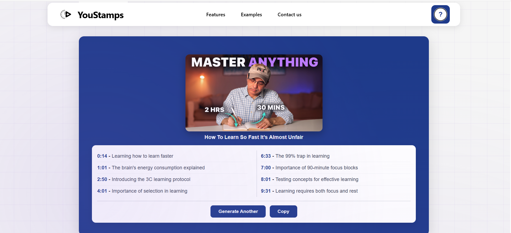

# YouStamps

> Turn any YouTube video into chapters, notes, and answers.

A web application that automatically generates chapter markers and timestamps for YouTube videos using AI. Paste a link and get timestamps, key takeaways, and searchable moments in seconds.



## Live Demo

**[https://my-react-app-899b1.firebaseapp.com/](https://my-react-app-899b1.firebaseapp.com/)**

## Features

- **AI-Powered Timestamps** - Automatically generates chapter markers for any YouTube video
- **Video Preview** - Shows thumbnail and title before processing
- **History Tracking** - Saves past generations to Firestore for quick access
- **Smart Caching** - Avoids re-processing videos already in history
- **Copy to Clipboard** - One-click copy of all timestamps
- **Clickable Chapters** - Each timestamp links directly to that point in the video
- **Authentication** - Email/password and Google OAuth sign-in
- **Anonymous Sessions** - Start using immediately, link account later
- **Responsive Design** - Works on desktop and mobile

## Tech Stack

| Layer | Technology |
|-------|------------|
| Frontend | React 19, React Router 7 |
| Backend | Firebase Cloud Functions (Python 3.13) |
| Database | Firebase Firestore |
| Authentication | Firebase Auth |
| Hosting | Firebase Hosting |
| Icons | FontAwesome |

## APIs Used

| API | Purpose |
|-----|---------|
| [Bumpups API](https://bumpups.com/) | AI-powered timestamp generation using the Bump-1.0 model |
| [YouTube oEmbed](https://oembed.com/) | Fetches video title and thumbnail |
| [Noembed](https://noembed.com/) | Fallback for video metadata (CORS-friendly) |
| YouTube Data API v3 | Development fallback for video metadata |

## Getting Started

### Prerequisites

- Node.js 18+
- Python 3.13 (for Cloud Functions)
- Firebase CLI (`npm install -g firebase-tools`)
- A Firebase project with Firestore, Auth, and Functions enabled
- Bumpups API key ([get one here](https://bumpups.com/))

### Installation

1. **Clone the repository**
   ```bash
   git clone https://github.com/yourusername/youstamps.git
   cd youstamps
   ```

2. **Install frontend dependencies**
   ```bash
   npm install
   ```

3. **Install Cloud Functions dependencies**
   ```bash
   cd functions
   pip install -r requirements.txt
   cd ..
   ```

4. **Configure environment variables**
   
   Create a `.env` file in the root directory:
   ```env
   REACT_APP_API_KEY=your_firebase_api_key
   REACT_APP_AUTH_DOMAIN=your_project.firebaseapp.com
   REACT_APP_PROJECT_ID=your_project_id
   REACT_APP_STORAGE_BUCKET=your_project.appspot.com
   REACT_APP_MESSAGING_SENDER_ID=your_sender_id
   REACT_APP_APP_ID=your_app_id
   REACT_APP_MEASUREMENT_ID=your_measurement_id
   REACT_APP_RECAPTCHA_SITE_KEY=your_recaptcha_key
   REACT_APP_USE_EMULATOR=false
   ```

5. **Set up Bumpups API key for Cloud Functions**
   ```bash
   firebase functions:secrets:set BUMPUPS_API_KEY
   ```

6. **Run the development server**
   ```bash
   npm start
   ```

### Deployment

```bash
# Build the React app
npm run build

# Deploy everything to Firebase
firebase deploy

# Or deploy individually
firebase deploy --only hosting
firebase deploy --only functions
```

## Project Structure

```
my-react-app/
├── public/                 # Static assets
├── src/
│   ├── assets/            # Images and logos
│   ├── unAuth/            # Unauthenticated user flow
│   │   ├── components/
│   │   │   ├── Timestamp.comp/   # Core timestamp feature
│   │   │   │   ├── enter.js      # URL input & video preview
│   │   │   │   ├── times.js      # Timestamp display
│   │   │   │   ├── history.js    # History carousel
│   │   │   │   └── firestoreStorage.js
│   │   │   ├── Navbar.js
│   │   │   ├── Login.js
│   │   │   ├── Signup.js
│   │   │   └── ...
│   │   └── LandingPage.js
│   ├── App.js
│   ├── firebase.js        # Firebase configuration
│   └── index.js
├── functions/
│   ├── main.py            # Cloud Function for timestamp generation
│   └── requirements.txt
├── firebase.json          # Firebase configuration
└── firestore.rules        # Firestore security rules
```

## How It Works

1. User pastes a YouTube URL
2. Frontend fetches video metadata via oEmbed/Noembed APIs
3. User clicks "Generate Timestamps"
4. Cloud Function calls Bumpups API with the video URL
5. AI analyzes the video and returns chapter markers
6. Timestamps are displayed and saved to Firestore
7. User can copy timestamps or click to jump to specific moments

## Environment Variables

| Variable | Description |
|----------|-------------|
| `REACT_APP_API_KEY` | Firebase API key |
| `REACT_APP_AUTH_DOMAIN` | Firebase auth domain |
| `REACT_APP_PROJECT_ID` | Firebase project ID |
| `REACT_APP_STORAGE_BUCKET` | Firebase storage bucket |
| `REACT_APP_MESSAGING_SENDER_ID` | Firebase messaging sender ID |
| `REACT_APP_APP_ID` | Firebase app ID |
| `REACT_APP_MEASUREMENT_ID` | Google Analytics measurement ID |
| `REACT_APP_RECAPTCHA_SITE_KEY` | reCAPTCHA v3 site key for App Check |
| `REACT_APP_USE_EMULATOR` | Set to `true` to use Firebase emulators |
| `BUMPUPS_API_KEY` | API key for Bumpups timestamp service (Cloud Functions secret) |

## License

This project does not currently have an open source license. All rights reserved.

---

Built with React and Firebase. Powered by [Bumpups](https://bumpups.com/) AI.
